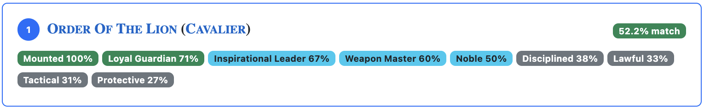
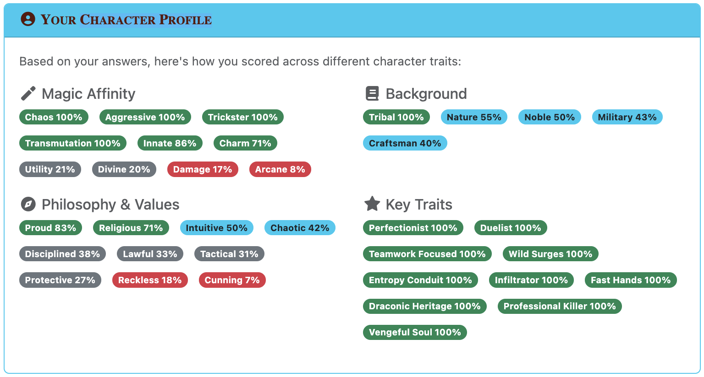

# D&D Site Development (Docker)

> Jekyll site for dnd.rigo.nu - Custom Varlyn rules and campaign documentation
>
> 🐳 **Fully containerized development environment**

## Quick Start

```bash
# Start local development server
make serve
```

Site will be available at: **http://localhost:4000/dnd/**

## Prerequisites

- **Docker** - The only requirement! No Ruby, Jekyll, or gems needed on your machine

## Development Commands

Run `make help` to see all available commands.

## Setup

`make serve` builds Docker image, mounts current directory, and starts Jekyll server on port 4000 with auto-reload.

## Site Structure

- **docs/** - Jekyll collections for content
  - `_Campaigns/` - Campaign documentation
  - `_Classes/` - Character classes
  - `_Folk/` - Races and peoples
  - `_Rules*/` - Game rules organized by category
- **assets/** - Static assets (CSS, JS, images)
- **_data/** - Site data (characters, navigation, etc.)
- **_includes/** - Reusable templates
- **_layouts/** - Page layouts
- **Dockerfile** - Container configuration
- **Gemfile** - Ruby dependencies

## Adding Content

1. Create markdown file in appropriate collection (e.g., `docs/_Classes/`, `docs/_Folk/`, `docs/_Campaigns/`)
2. Add YAML frontmatter (see existing files)
3. Update `_data/` if adding characters/scenery
4. Run `make validate-profiles` (classes) or `make lint-md` (formatting)

## Troubleshooting

**Container won't start:**
```bash
make clean        # Clean everything
make build        # Rebuild Docker image
make serve        # Try again
```

**Common Issues:**
- Port in use: `make clean`
- Build failures: `docker ps` and `docker logs`
- Changes not reflected: `Ctrl+C` and `make serve`

## Deployment

Site deploys automatically to **https://dnd.rigo.nu** when pushing to `main` branch via GitHub Pages.

## Developer Tools

See `tools/README.md` for complete tool documentation and usage.

## Questionnaire Scoring System

### Multi-Dimensional Trait Scoring

Each answer affects multiple traits with positive/negative values. Player scores are calculated as percentages and matched against class profile requirements.

**Data Structure:**
```yaml
# _data/question-bank.yml
- id: healing-magic
  text: "Do you want to heal and protect your allies?"
  answers:
    "yes":
      healing-magic: +4      # Strong FOR healing
      damage-magic: -2       # Moderate AGAINST damage
      utility-magic: +1      # Slight toward utility
    "no":
      healing-magic: -2      # Against healing
      damage-magic: +4       # Strong for damage
```

**Scoring Algorithm:**

1. **Folk Selection (Optional):**
   - System scans all archetypes for `restriction.folk` fields
   - If folk-restricted archetypes exist, user selects their folk/race (or skips)
   - Only matching archetypes (plus unrestricted ones) will appear in results

   ```yaml
   # Example: Folk-restricted archetype
   path-of-the-battlerager:
     restriction:
       folk: ["dwarf"]  # Can be single string or array
     traits: ["reckless-value", "heavy-armor", "unstoppable-force"]
   ```

2. **Accumulate scores** as player answers:
   ```javascript
   traitScores = {
     'healing-magic': { current: 0, min: 0, max: 0 },
     'damage-magic': { current: 0, min: 0, max: 0 },
     // ... etc
   }

   // For each question, update all affected traits
   for (question in questions) {
     for (trait in question.answer[playerChoice]) {
       traitScores[trait].current += trait.value
       traitScores[trait].min += (min possible value this Q)
       traitScores[trait].max += (max possible value this Q)
     }
   }
   ```

3. **Calculate alignment percentage:**
   ```javascript
   percentage = (current - min) / (max - min) * 100

   // Example: healing-magic
   // current: +6, min: -4, max: +10
   // percentage = (6 - (-4)) / (10 - (-4)) = 10/14 = 71%
   ```

4. **Match to class profiles:**
   ```yaml
   # docs/_Classes/cleric.md
   profile:
     traits: ["religious-value", "divine-magic", "healing-magic", "protective-value"]
     archetypes:
       life-domain:
         traits: ["divine-healer"]
       light-domain:
         traits: ["holy-power", "divine-healer", "illuminating-light"]
   ```

   Match score = Player's percentage in required traits

   

5. **Filter by folk restrictions:**
   - During recommendation generation, archetypes are filtered by folk selection
   - Archetypes with `restriction.folk` only appear if user's folk matches
   - Unrestricted archetypes always appear regardless of folk selection
   - If user skipped folk selection, only unrestricted archetypes are shown

6. **Filter by trait mismatch (default):**
   - Archetypes are evaluated for "trait mismatches" - cases where user scored <20% on required traits
   - By default, only "strict matches" are shown (archetypes with no trait mismatches)
   - If partial matches exist, users can toggle to show all recommendations including those with low-scoring traits
   - This prevents suggesting archetypes that conflict with strongly negative user responses

**Character Profile Display:**

After completing the questionnaire, users see their personalized character profile organized into trait categories:



- **Magic Affinity** (`*-magic` traits) - Shows magical preferences and inclinations
  - Examples: `healing-magic`, `damage-magic`, `divine-magic`, `arcane-magic`
  - Displayed as: "Healing 71%", "Damage 45%", "Divine 82%"

- **Background** (`*-background` traits) - Represents character origins and experience
  - Examples: `military-background`, `academic-background`, `tribal-background`
  - Displayed as: "Military 68%", "Academic 54%"

- **Philosophy & Values** (`*-value` traits) - Core beliefs and worldview
  - Examples: `lawful-value`, `chaotic-value`, `protective-value`, `cunning-value`
  - Displayed as: "Lawful 75%", "Protective 62%"

- **Key Traits** (all other traits) - Combat styles, skills, and characteristics
  - Examples: `weapon-master`, `shield-specialist`, `stealth-master`

**Implementation Files:**
- `_data/question-bank.yml` - Question definitions with trait scoring
- `assets/js/questionnaire.js` - Scoring engine and recommendation algorithm
- `_layouts/questionnaire.html` - Template that loads data and questionnaire.js
- `docs/_Classes/*.md` - Class profiles with trait requirements

---

## Adaptive Question Selection

Questions adapt to explore unexplored traits for top recommended classes. Starts random, then targets traits needed by lowest-ranked recommendations, ensuring all archetypes get fair evaluation.

## Adding New Archetypes

The questionnaire system automatically includes new archetypes when they're properly structured in class files:

1. **Add archetype to class file** - Follow existing YAML structure with traits array
2. **Define trait mappings** - Use consistent trait names across archetypes
3. **Add folk restrictions (optional)** - Use `restriction.folk` field if archetype is folk-specific
4. **Validate schema** - Run `make validate-profiles` to check structure
5. **Test scoring** - Run `make test-class-scoring` to verify recommendation logic
6. **Update search** - Run `make extract` to include in searchable content

For trait naming and archetype patterns, reference existing class files in `docs/_Classes/`.
